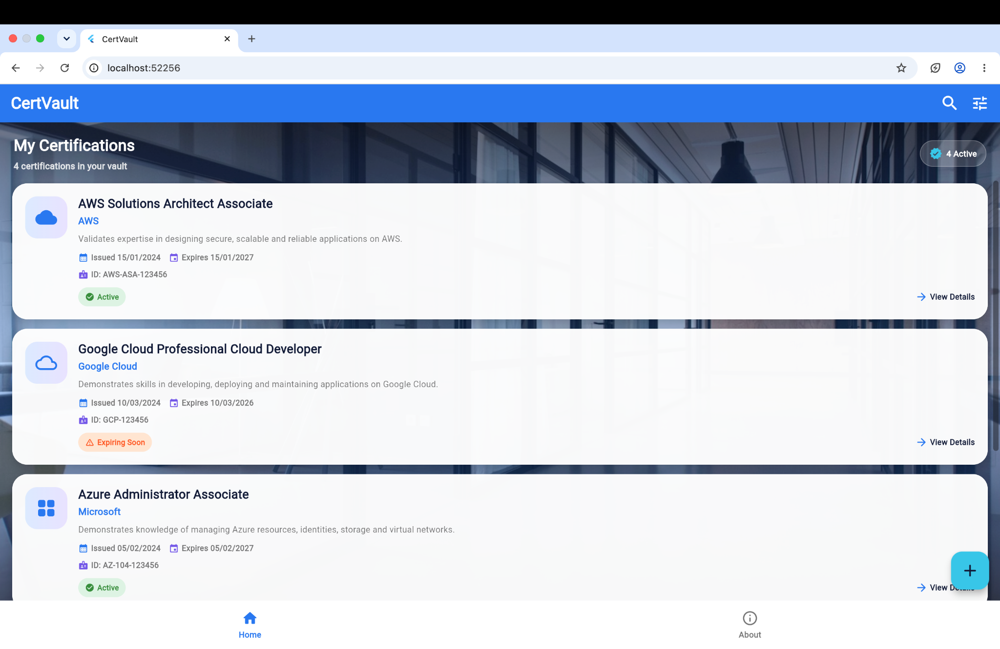
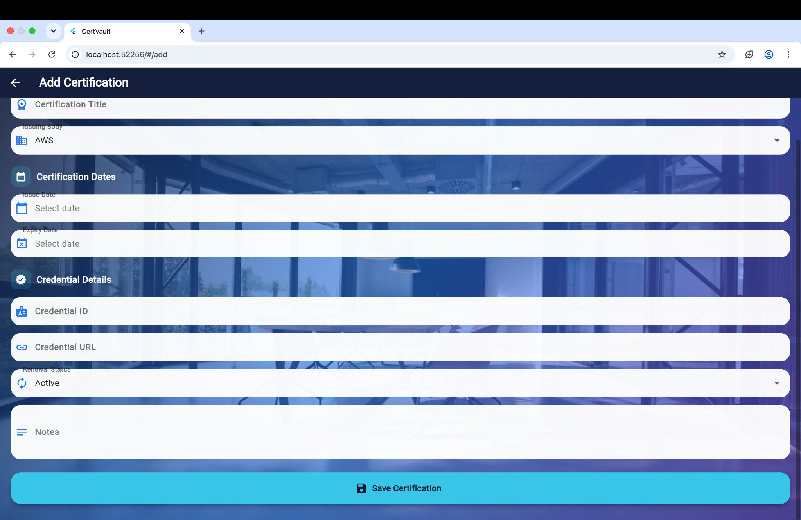
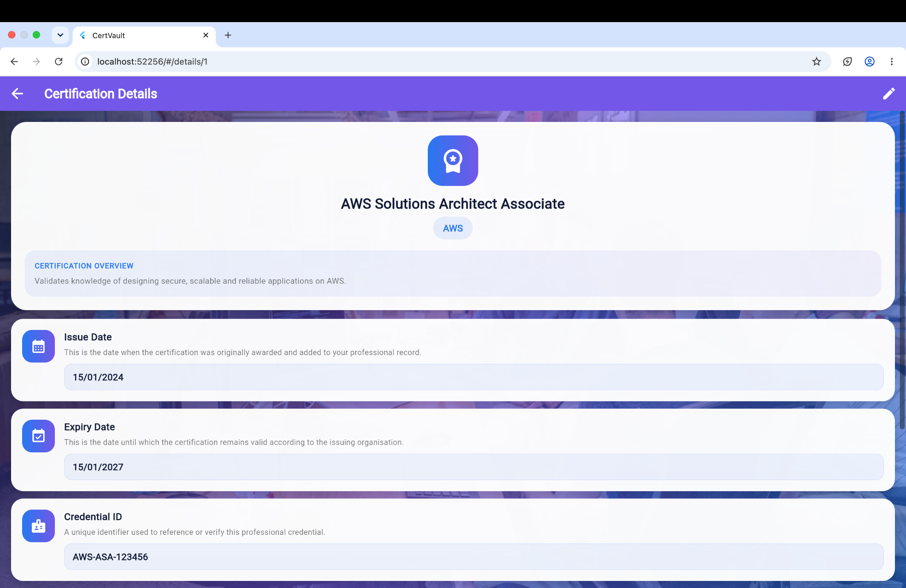

# CertVault – Certification Tracker

## Class Test Project

**Name:** Parth Sahani  
**Roll Number:** 150096724135  
**Cohort:** Elon Musk  

---

## 📌 Project Overview

**CertVault** is a Flutter-based Certification Tracker application designed to help users store, view, search and manage their professional certifications in one place.

The application allows users to maintain important certification information such as certification title, issuing organisation, issue date, expiry date, credential ID/URL, renewal status and notes.

### Technologies Used

- Flutter
- Dart
- Material 3
- Riverpod 2.0 – State Management
- GoRouter 2.0 – Declarative Navigation

---

## ✨ App Functions

- **View Certifications:** Displays all saved certifications with their title, issuer, issue date, expiry date and renewal status.
- **Add Certification:** Allows users to add a new certification with complete details.
- **Search Certifications:** Searches certifications by their name.
- **View Details:** Shows complete information about a selected certification.
- **Credential Access:** Allows users to open/search the credential information.
- **Renewal Tracking:** Displays the current renewal status of each certification.
- **About:** Shows the user's project/student information.

---

# 🖥️ Screenshots

## 🏠 Home List Screen



The Home screen displays all saved certifications with their important information, dates and renewal status.

---

## ➕ Add Certification Screen



The Add Certification screen provides a form for entering and saving a new certification.

---

## 📋 Certification Details Screen



The Details screen displays complete information about the selected certification, including issue date, expiry date, credential information, renewal status and notes.

---

# 🌳 Widget Trees

## 1. Home List Screen Widget Tree

```text
Scaffold
├── AppBar
│   ├── CertVault
│   ├── Search
│   └── Filter
├── Body
│   └── ListView.builder
│       └── Card
│           ├── Certification Title
│           ├── Issuer
│           ├── Dates
│           └── Renewal Status
├── FloatingActionButton
│   └── Add Certification
└── BottomNavigationBar
    ├── Home
    └── About
````

* **Scaffold** – Main structure of the screen.
* **AppBar** – Displays CertVault, Search and Filter buttons.
* **Body → ListView.builder** – Displays all certification cards.
* **Card** – Shows certification title, issuer, dates and status.
* **FloatingActionButton** – Opens the Add Certification screen.
* **BottomNavigationBar** – Provides Home and About navigation.

---

## 2. Add Certification Screen Widget Tree

```text
Scaffold
├── AppBar
│   └── Add Certification
└── Body
    └── SingleChildScrollView
        └── Form
            ├── TextFormField
            ├── DropdownButtonFormField
            ├── Date Pickers
            ├── Credential Details
            ├── Renewal Status
            └── ElevatedButton
                └── Save Certification
```

* **Scaffold** – Main screen structure.
* **AppBar** – Shows the Add Certification title and navigation.
* **SingleChildScrollView** – Allows the form to scroll.
* **Form** – Validates the certification information.
* **TextFormField / DropdownButtonFormField** – Takes certification title, issuer, dates, credential details and renewal status.
* **ElevatedButton** – Saves the certification.

---

## 3. Details Screen Widget Tree

```text
Scaffold
├── AppBar
│   └── Certification Details
└── Body
    └── SingleChildScrollView
        └── Column
            ├── Icon / Logo
            ├── Title
            ├── Subtitle
            ├── Detail Sections
            │   ├── Issue Date
            │   ├── Expiry Date
            │   ├── Credential ID / URL
            │   ├── Renewal Status
            │   └── Notes
            └── Credential Button
```

* **Scaffold** – Main screen structure.
* **AppBar** – Shows Certification Details with Back and Edit actions.
* **SingleChildScrollView** – Allows all details to fit on smaller screens.
* **Column** – Organises the certification information vertically.
* **Icon/Logo + Title + Subtitle** – Displays the certification identity.
* **Detail sections** – Shows issue date, expiry date, credential ID/URL, renewal status and notes.
* **OutlinedButton** – Opens the credential/search option.

---

# 🚀 How to Use

1. Open the app on the **Home** screen to view certifications.
2. Tap the **+** button to add a new certification.
3. Enter the certification details and tap **Save Certification**.
4. Tap any certification card to view its details.
5. Use the **Search** icon to find a certification by name.
6. Use the **Open Credential** option to access the credential.
7. Use the **About** section to view project/user information.

---

# 🧭 Navigation

```text
/                    → Home List Screen
/add                 → Add Certification Screen
/details/:id         → Certification Details Screen
```

The application uses **GoRouter** for declarative navigation between screens.

---

# 📁 Project Structure

```text
CertVault
│
├── main.dart
├── home_screen.dart
├── add_certification_screen.dart
├── details_screen.dart
├── README.md
│
└── screenshots
    ├── home.png
    ├── add_certification.png
    └── details.png
```

---

# 👨‍💻 Student Information

**Name:** Parth Sahani
**Roll Number:** 150096724135
**Cohort:** Elon Musk

**Project:** CertVault – Certification Tracker
**Project Type:** Class Test Project
**Platform:** Flutter / Dart

````
GitHub will render the three screenshots **directly on the README page**.

**Do not upload the screenshots into the root again.** Your existing `screenshots` folder is exactly what these paths are referring to.
